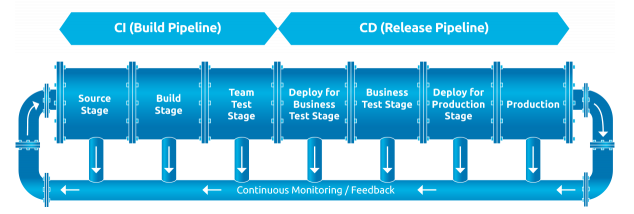

# 27 - CICD Pipeline #
_____________________________________________________

## CICD ##

This is the practice of **Continuous Integration and Continuous Deployment** - constantly updating your software and integrating and rolling out as frequently as possible.

This shortens time between the development of feature or a fix and going live to production.

This is based on the belief that deployment of software should be easy and available on demand. This helps to produce high quality software with lower costs and shorter time to deployment. This is something that need to be planned and architected.

## CONTINUOUS INTEGRATION ##

Automating the combination of code changes from multiple contributors into a single code base.

Let's say you are working with a team, and you are all working on a single codebase simultaneously. As each member updates the code, there could be a tendency for one change to conflict with another's change.

This is where CI comes in. The faster you can resolve the conflicts, merge and integrate everyone's code, and test it, the better the code output will be.

It is also possible that you're only person working on the code and you need to merge your changes with the code you last updated a couple months ago.

## COMPONENTS OF CONTINOUS INTEGRATION ##

1. **SOURCE CODE CONTROL**

    Version control system. By checking in your code into a good version control system like Git, you can start off the whole process.
     

2. **BUILD AUTOMATION**
    Automatic compilation of your code. Anything that is needed to build your software should happen automatically once code changes are checked in.
     

3. **UNIT TESTING**
    Automatic testing of the individual components of your code. You can look into the practice of *TDD* or *Test-Driven Development*.
     

4. **BRANCH MERGING**
    This is where your source control merges all the code changes to set you up for integration testing.
     

5. **INTEGRATION TESTING**
    This is the second test. This is where the individual components are tested to see if they work together smoothly.

## CONTINUOUS DEPLOYMENT ##

Automating the delivery of IT services to users.